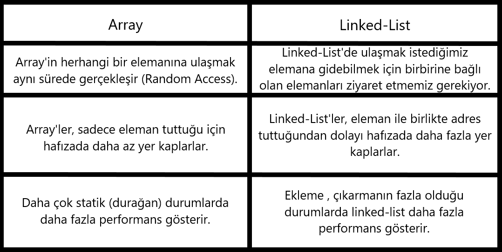

# Data-Structures-and-Algorithms
Data Structures and Algorithms My Theoretical Knowledge 


## Array & Linked List



```
                      Insertion Sort Aşamaları ve Big-O Gösterimi:
Verilen dizi: [22,27,16,2,18,6]

Insertion Sort aşamaları:

22 elemanı ilk eleman olarak kabul edilir.
27 elemanı 22'den büyük olduğu için dizinin sonuna eklenir.
16 elemanı 22'den küçük olduğu için 22'nin soluna eklenir.
2 elemanı dizideki tüm elemanlardan küçük olduğu için dizinin en başına eklenir.
18 elemanı 2 ve 22 arasında olduğu için doğru konumuna yerleştirilir.
6 elemanı 2 ve 16 arasında olduğu için doğru konumuna yerleştirilir.
Big-O gösterimi:

En iyi durum: O(n)
Ortalama durum: O(n^2)
En kötü durum: O(n^2)
18 sayısının Time Complexity kapsamı:

Ortalama case: Aradığımız sayı ortada olduğu için, 18 sayısı için time complexity O(n^2) olacaktır.
Worst case: Aradığımız sayı sonda olduğu için, 18 sayısı için time complexity O(n^2) olacaktır.
Best case: Aradığımız sayı dizinin en başında olduğu için, 18 sayısı için time complexity O(n) olacaktır.
Selection Sort İlk 4 Adımı:
Verilen dizi: [7,3,5,8,2,9,4,15,6]

Selection Sort ilk 4 adımı:

Dizideki en küçük eleman bulunur (2).
En küçük eleman dizinin en başına yerleştirilir. Dizinin yeni hali: [2,7,3,5,8,9,4,15,6].
İkinci en küçük eleman bulunur (3).
İkinci en küçük eleman dizinin ikinci sırasına yerleştirilir. Dizinin yeni hali: [2,3,7,5,8,9,4,15,6].
Not: Selection Sort algoritmasının tüm adımları için, bu işlem dizideki tüm elemanlar sıralanana kadar devam eder.
```

```
                       Merge Sort Aşamaları ve Big-O Gösterimi:
Verilen dizi: [16,21,11,8,12,22]

Merge Sort aşamaları:

Dizi ikiye bölünür: [16,21,11] ve [8,12,22].
Her iki alt dizi de özyinelemeli olarak sıralanır.
Sıralanan alt diziler birleştirilir: [8,11,12,16,21,22].
Big-O gösterimi: O(n log n)

Merge Sort'un çalışma prensibi:

Dizi sürekli olarak ikiye bölünür ve en küçük alt dizilere kadar bu işlem devam eder.
En küçük alt diziler sıralandıktan sonra, birleştirilerek daha büyük sıralı diziler oluşturulur.
Bu işlem, tüm dizi sıralanana kadar devam eder.
Merge Sort'un avantajları:

Hızlı bir sıralama algoritmasıdır.
Veri setinin boyutu ne olursa olsun, her zaman O(n log n) karmaşıklığına sahiptir.
Bellek kullanımı nispeten azdır.
Merge Sort'un dezavantajları:

Yerinde sıralama algoritması değildir.
Küçük veri setleri için Quicksort gibi diğer algoritmalardan daha yavaş olabilir.
Örnek:
Yukarıdaki dizide, ilk aşamada iki alt dizi oluşturulur:

[16,21,11]
[8,12,22]
Bu alt diziler özyinelemeli olarak sıralanır:

[11,16,21]
[8,12,22]
Daha sonra, sıralanan alt diziler birleştirilerek son dizinin elde edilir:

[8,11,12,16,21,22]
Big-O Gösterimi:

Merge Sort algoritmasının karmaşıklığı O(n log n)'dir. Nedeni ise:

Her adımda dizi ikiye bölünür. Bu işlem log n kere tekrarlanır.
Her alt dizide n eleman sıralanır.
Bu iki faktörden dolayı, Merge Sort'un karmaşıklığı O(n log n)'dir.

```


```
                            Binary Search Tree Aşamaları:
Verilen dizi: [7, 5, 1, 8, 3, 6, 0, 9, 4, 2]

Aşamalar:

1.Kök (root): 7
 -Sağ: 8
    -Sağ: 9
    -Sol: 6
 -Sol: 5
    -Sağ: 3
       -Sol: 2
    -Sol: 1
       -Sol: 0
       -Sağ: 4
       
Açıklama:

İlk eleman (7) root olarak kabul edilir.
Sağ alt dal, root'tan büyük elemanları (8, 9, 6) içerir.
Sol alt dal, root'tan küçük elemanları (5, 3, 2, 1, 0, 4) içerir.
Her eleman, kendinden büyük elemanların sağında, kendinden küçük elemanların solunda yer alır.
Bu şekilde, Binary Search Tree'nin sıralı yapısı oluşur.
```

